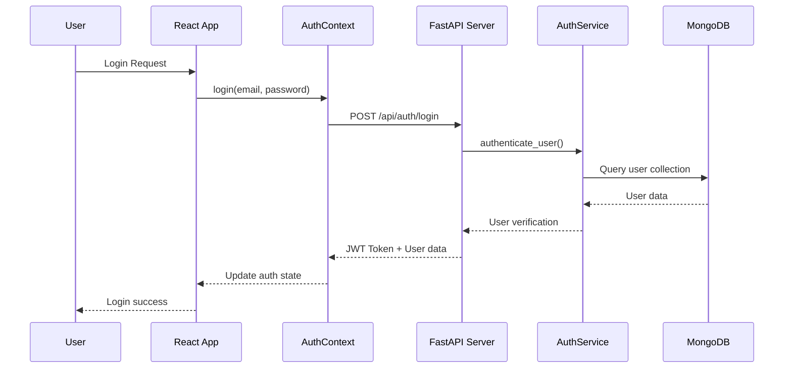
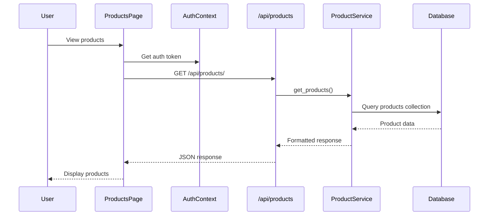
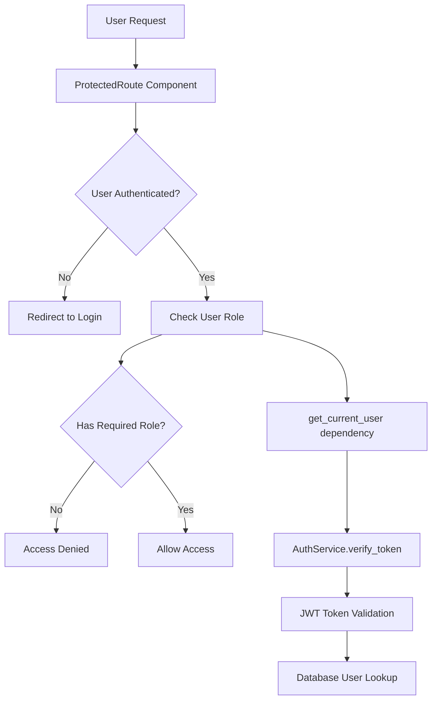

# Vallmark Gift Articles - File Dependencies Mind Map

## 🗂️ System Architecture Dependencies

```mermaid
graph TB
    %% Main Application Entry Points
    subgraph "Frontend Entry"
        FE_INDEX[frontend/src/index.js]
        FE_APP[frontend/src/App.js]
        FE_INDEX --> FE_APP
    end
    
    subgraph "Backend Entry" 
        BE_SERVER[backend/server.py]
        BE_STARTUP[backend/startup_tasks.py]
        BE_SERVER --> BE_STARTUP
    end

    %% Authentication System
    subgraph "Authentication Layer"
        AUTH_SERVICE[backend/auth.py]
        AUTH_CONTEXT[frontend/src/contexts/AuthContext.js]
        PROTECTED_ROUTE[frontend/src/components/ProtectedRoute.js]
        
        AUTH_SERVICE --> MODELS[backend/models.py]
        AUTH_CONTEXT --> |API Calls| BE_SERVER
        PROTECTED_ROUTE --> AUTH_CONTEXT
    end

    %% Database Layer
    subgraph "Database Layer"
        MODELS
        SEED_DB[backend/seed_database.py]
        
        MODELS --> |Defines Schemas| SEED_DB
        BE_STARTUP --> |Auto-seed| SEED_DB
        AUTH_SERVICE --> |User Management| MODELS
    end

    %% API Routes System
    subgraph "Backend API Routes"
        ROUTE_AUTH[backend/routes/auth.py]
        ROUTE_PRODUCTS[backend/routes/products.py] 
        ROUTE_ORDERS[backend/routes/orders.py]
        ROUTE_CART[backend/routes/cart.py]
        ROUTE_DASHBOARD[backend/routes/dashboard.py]
        ROUTE_CAMPAIGNS[backend/routes/campaigns.py]
        ROUTE_COMMISSIONS[backend/routes/commissions.py]
        ROUTE_INVENTORY[backend/routes/inventory.py]
        ROUTE_INQUIRIES[backend/routes/inquiries.py]
        ROUTE_UPLOADS[backend/routes/uploads.py]
        ROUTE_CATEGORIES[backend/routes/categories.py]
        
        %% All routes depend on auth and models
        ROUTE_AUTH --> AUTH_SERVICE
        ROUTE_AUTH --> MODELS
        
        ROUTE_PRODUCTS --> AUTH_SERVICE
        ROUTE_PRODUCTS --> MODELS
        
        ROUTE_ORDERS --> AUTH_SERVICE
        ROUTE_ORDERS --> MODELS
        
        ROUTE_CART --> AUTH_SERVICE
        ROUTE_CART --> MODELS
        
        ROUTE_DASHBOARD --> AUTH_SERVICE
        ROUTE_DASHBOARD --> MODELS
        
        ROUTE_CAMPAIGNS --> AUTH_SERVICE
        ROUTE_CAMPAIGNS --> MODELS
        
        ROUTE_COMMISSIONS --> AUTH_SERVICE
        ROUTE_COMMISSIONS --> MODELS
        
        ROUTE_INVENTORY --> AUTH_SERVICE
        ROUTE_INVENTORY --> MODELS
        
        ROUTE_INQUIRIES --> AUTH_SERVICE
        ROUTE_INQUIRIES --> MODELS
        
        ROUTE_UPLOADS --> AUTH_SERVICE
        ROUTE_UPLOADS --> MODELS
        
        ROUTE_CATEGORIES --> AUTH_SERVICE
        ROUTE_CATEGORIES --> MODELS
        
        %% Server includes all routes
        BE_SERVER --> ROUTE_AUTH
        BE_SERVER --> ROUTE_PRODUCTS
        BE_SERVER --> ROUTE_ORDERS
        BE_SERVER --> ROUTE_CART
        BE_SERVER --> ROUTE_DASHBOARD
        BE_SERVER --> ROUTE_CAMPAIGNS
        BE_SERVER --> ROUTE_COMMISSIONS
        BE_SERVER --> ROUTE_INVENTORY
        BE_SERVER --> ROUTE_INQUIRIES
        BE_SERVER --> ROUTE_UPLOADS
        BE_SERVER --> ROUTE_CATEGORIES
    end

    %% Frontend Components System
    subgraph "Frontend Components"
        COMP_LOGIN[frontend/src/components/Login.js]
        COMP_REGISTER[frontend/src/components/Register.js]
        COMP_PRODUCTS[frontend/src/components/ProductsPage.js]
        COMP_PRODUCT_DETAIL[frontend/src/components/ProductDetail.js]
        COMP_USER_PROFILE[frontend/src/components/UserProfile.js]
        COMP_LOGO[frontend/src/components/Logo.js]
        
        %% Authentication components
        COMP_LOGIN --> AUTH_CONTEXT
        COMP_REGISTER --> AUTH_CONTEXT
        COMP_USER_PROFILE --> AUTH_CONTEXT
        
        %% Product components
        COMP_PRODUCTS --> |API Calls| ROUTE_PRODUCTS
        COMP_PRODUCT_DETAIL --> |API Calls| ROUTE_PRODUCTS
        COMP_PRODUCTS --> AUTH_CONTEXT
        COMP_PRODUCT_DETAIL --> AUTH_CONTEXT
        
        %% App routing
        FE_APP --> COMP_LOGIN
        FE_APP --> COMP_REGISTER
        FE_APP --> COMP_PRODUCTS
        FE_APP --> COMP_PRODUCT_DETAIL
        FE_APP --> COMP_USER_PROFILE
        FE_APP --> COMP_LOGO
        FE_APP --> AUTH_CONTEXT
        FE_APP --> PROTECTED_ROUTE
    end

    %% Admin Dashboard Components
    subgraph "Admin Components"
        ADMIN_DASHBOARD[frontend/src/components/admin/AdminDashboard.js]
        ADMIN_COMPONENTS[frontend/src/components/admin/*]
        ROLE_BASED_ROUTE[frontend/src/components/RoleBasedRoute.js]
        
        ADMIN_DASHBOARD --> AUTH_CONTEXT
        ADMIN_DASHBOARD --> |API Calls| ROUTE_DASHBOARD
        ADMIN_DASHBOARD --> |API Calls| ROUTE_AUTH
        
        ROLE_BASED_ROUTE --> AUTH_CONTEXT
        FE_APP --> ADMIN_DASHBOARD
        FE_APP --> ROLE_BASED_ROUTE
        
        ADMIN_COMPONENTS --> AUTH_CONTEXT
        ADMIN_COMPONENTS --> |Various API Calls| BE_SERVER
    end

    %% Dashboard Components
    subgraph "Dashboard Components" 
        DASHBOARD_COMPONENTS[frontend/src/components/dashboards/*]
        
        DASHBOARD_COMPONENTS --> AUTH_CONTEXT
        DASHBOARD_COMPONENTS --> |API Calls| ROUTE_DASHBOARD
        DASHBOARD_COMPONENTS --> |API Calls| ROUTE_PRODUCTS
        DASHBOARD_COMPONENTS --> |API Calls| ROUTE_ORDERS
        DASHBOARD_COMPONENTS --> |API Calls| ROUTE_COMMISSIONS
        
        FE_APP --> DASHBOARD_COMPONENTS
    end

    %% Styling and Configuration
    subgraph "Styling & Config"
        TAILWIND_CONFIG[frontend/tailwind.config.js]
        POSTCSS_CONFIG[frontend/postcss.config.js]
        APP_CSS[frontend/src/App.css]
        INDEX_CSS[frontend/src/index.css]
        
        FE_APP --> APP_CSS
        FE_INDEX --> INDEX_CSS
        APP_CSS --> TAILWIND_CONFIG
        INDEX_CSS --> TAILWIND_CONFIG
        TAILWIND_CONFIG --> POSTCSS_CONFIG
    end

    %% Environment Configuration
    subgraph "Environment Config"
        BE_ENV[backend/.env]
        FE_ENV[frontend/.env]
        BE_REQUIREMENTS[backend/requirements.txt]
        FE_PACKAGE[frontend/package.json]
        
        BE_SERVER --> |Loads env vars| BE_ENV
        AUTH_SERVICE --> |Encryption keys| BE_ENV
        BE_STARTUP --> |Config| BE_ENV
        
        AUTH_CONTEXT --> |Backend URL| FE_ENV
        FE_APP --> |App config| FE_ENV
    end

    %% External Dependencies
    subgraph "External Libraries"
        FASTAPI[FastAPI Framework]
        MOTOR[Motor MongoDB Driver]
        PYMONGO[PyMongo]
        BCRYPT[Bcrypt]
        JWT[PyJWT]
        
        REACT[React 18]
        REACT_ROUTER[React Router DOM]
        AXIOS[Axios HTTP Client]
        TAILWIND[Tailwind CSS]
        LUCIDE[Lucide React Icons]
        
        %% Backend dependencies
        BE_SERVER --> FASTAPI
        AUTH_SERVICE --> BCRYPT
        AUTH_SERVICE --> JWT
        MODELS --> MOTOR
        SEED_DB --> PYMONGO
        
        %% Frontend dependencies  
        FE_APP --> REACT
        FE_APP --> REACT_ROUTER
        AUTH_CONTEXT --> AXIOS
        COMP_PRODUCTS --> AXIOS
        FE_APP --> TAILWIND
        FE_APP --> LUCIDE
    end
```

## 🔄 Key Dependency Relationships

### 1. Authentication Flow

### 2. Product Management Flow

### 3. Role-Based Access Control

## 📊 File Interaction Matrix

### Backend Core Dependencies
| File | Depends On | Used By |
|------|------------|---------|
| `server.py` | All route modules, startup_tasks | Main entry point |
| `auth.py` | models.py, .env | All route modules |
| `models.py` | pydantic, enums | All modules |
| `startup_tasks.py` | seed_database.py | server.py |
| `seed_database.py` | models.py, auth.py | startup_tasks.py |

### Frontend Core Dependencies
| File | Depends On | Used By |
|------|------------|---------|
| `App.js` | All components, AuthContext | index.js |
| `AuthContext.js` | axios, .env | All components |
| `ProductsPage.js` | AuthContext, axios | App.js routing |
| `Login.js` | AuthContext | App.js routing |
| `ProtectedRoute.js` | AuthContext | App.js routing |

### API Route Dependencies
| Route Module | Core Dependencies | Business Logic |
|--------------|------------------|----------------|
| `auth.py` | AuthService, UserService, Models | User authentication, registration |
| `products.py` | ProductService, AuthService, Models | Product CRUD, assignment logic |
| `orders.py` | OrderService, AuthService, Models | Order processing, payment |
| `dashboard.py` | Multiple services, AuthService | Analytics, reporting |
| `commissions.py` | CommissionService, AuthService | Commission calculations |

## 🔍 Critical Integration Points

### 1. Authentication Integration
- **Backend**: `auth.py` ↔ `server.py` (dependency injection)
- **Frontend**: `AuthContext.js` ↔ All protected components
- **Security**: JWT tokens passed via HTTP headers

### 2. Database Integration
- **Models**: Centralized schema definitions in `models.py`
- **Services**: Each route module has corresponding service class
- **Seeding**: Automatic population via `startup_tasks.py`

### 3. API Communication
- **Base URL**: Configured in `frontend/.env` as `REACT_APP_BACKEND_URL`
- **Authentication**: Bearer tokens in Axios interceptors
- **Error Handling**: Centralized in AuthContext

### 4. Role-Based Routing
- **Backend**: Role checks in route dependencies (`get_admin_user`, etc.)
- **Frontend**: Component-level route protection via `ProtectedRoute.js`
- **Data Filtering**: Role-based data access in service methods

## 🚀 Startup Sequence

### Backend Startup
1. `server.py` loads environment variables
2. FastAPI app initialization
3. Database connection setup (Motor/MongoDB)
4. Route module registration
5. `startup_tasks.py` execution
6. Auto-seeding if enabled
7. Health check endpoint availability

### Frontend Startup
1. `index.js` renders React app
2. `App.js` initializes routing and context
3. `AuthContext` checks for existing auth token
4. Theme initialization (dark/light mode)
5. API connectivity test
6. Component rendering based on auth state

This dependency map shows the complete interconnection of all system components, making it easier to understand the codebase architecture and plan modifications or debugging efforts.